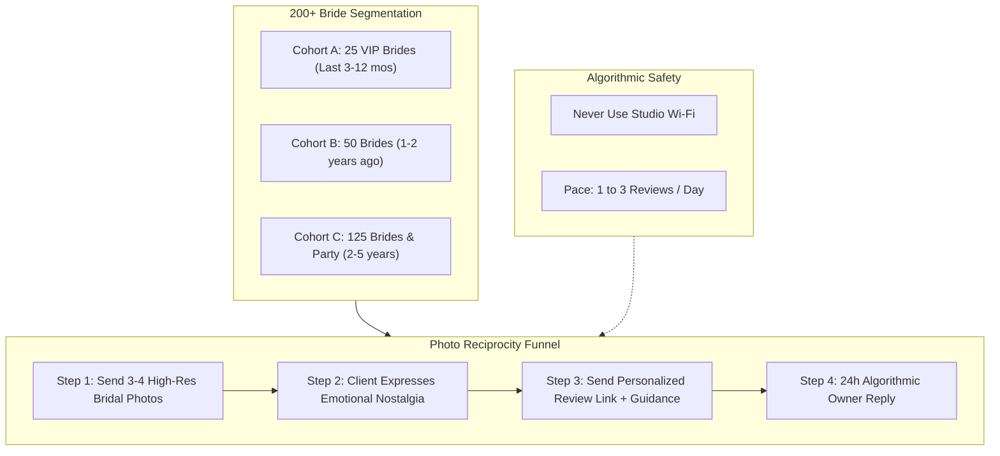
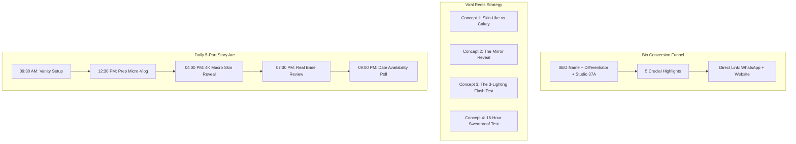
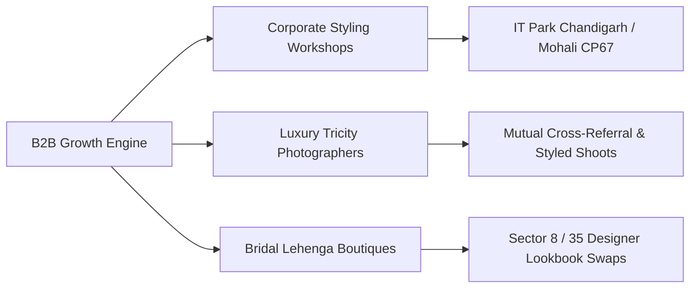
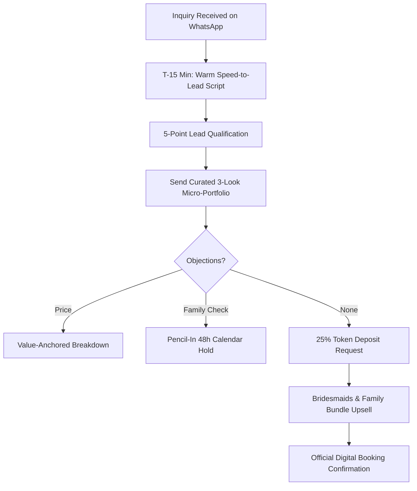

# Makeovers by Bhuvita: 14-Day Brand Owner & Business Growth Action Plan
**Location:** Sector 37A, Chandigarh (Serving Chandigarh, Mohali, Panchkula, Zirakpur, Kharar & Destination)  
**Brand Founder:** Bhuvita (Certified by UV Ghai | 5+ Years Experience | 200+ Brides)  
**Primary Positioning:** *Signature Subtle, Skin-Like Bridal Artistry & Luxury Long-Wear Glamour*  
**Core Assets:** Website (`makeoversbybhuvita.com`), WhatsApp (+91 78888 08231), Instagram (@makeoversbybhuvita)  
**Document Classification:** Operational & Revenue Growth Playbook (Restricted to Brand Owner)

---

## Executive Summary & Strategic Positioning

The bridal makeup market in the Chandigarh Tricity region is highly competitive, dominated by two polar extremes:
1. **The Mass Commercial Salons:** Offering heavily discounted, rushed, assembly-line bridal packages in Sectors 35, 22, and 17, often using thick, pancake foundation, unblended contouring, and chalky flashback formulas that make modern brides look 10 years older and unrecognizable to their partners.
2. **The High-Ticket Celebrity Artists:** Charging ₹45,000 to ₹75,000+ per event with detached client communication and high overheads.

### Bhuvita’s Strategic Moat (The High-Ticket Sweet Spot)
Bhuvita sits directly in the most lucrative high-ticket tier (₹22,000 – ₹30,000 for Bridal, ₹9,000 – ₹18,000 for Pre-Wedding events, ₹4,000 – ₹6,000 for Bridesmaids/Party Makeup). Her decisive competitive advantage is **"Subtle, skin-like bridal makeup that looks glowing in person and flawless under 4K cinematography without flashback or cakeiness."**

```
                                      MARKET POSITIONING MATRIX
               High Price (₹45k+)
                      │
                      │         Celebrity Artists
                      │         (Detached, high fees)
                      │
                      │                  ★ MAKEOVERS BY BHUVITA
                      │                  (Subtle, Skin-Like, Personalized Luxury)
                      │
   Heavy/Cakey ───────┼──────────────────────── Natural / Skin-Like Finish
   Traditional        │
                      │
                      │         Mass Salons (Sectors 22/35)
                      │         (Assembly line, chalky flashback)
                      │
               Budget Tier (<₹15k)
```

Modern brides in North India (especially corporate professionals, doctors, tech executives in Rajiv Gandhi IT Park Chandigarh / Mohali CP67, and NRI brides from Canada, the UK, and Australia having weddings in Tricity) have one primary psychological fear:  
> *"I do not want to look like a painted stranger at my own wedding."*

This 14-day action plan systematically constructs an organic growth engine that eliminates that fear across every digital touchpoint, establishes local Google search dominance, extracts social proof from Bhuvita’s 200+ past brides, and builds a predictable WhatsApp closing engine converting cold inquiries into 25% non-refundable deposits.

---

## Pillar 1: Google Business Profile (GBP) Domination Blueprint

Google Local 3-Pack rankings drive the highest-intent, non-price-sensitive bridal inquiries in Tricity. When an NRI bride or a mother-of-the-bride searches *"best bridal makeup artist in Chandigarh"* or *"makeup artist near me Sector 37"*, ranking in the top 3 positions generates 40% to 60% of all phone calls and WhatsApp clicks without paid ads.


### 1.1 Step-by-Step Claiming & Exact Policy Compliance
To prevent automated algorithmic suspensions by Google's anti-spam filters:

1. **Google Account:** Use a clean, dedicated Google Workspace account (e.g., `contact@makeoversbybhuvita.com` or `makeoversbybhuvita@gmail.com`).
2. **Business Name Policy:** Register strictly as:
   `Makeovers by Bhuvita - Bridal Makeup Artist Chandigarh`  
   *(Google permits brand name + descriptor, but avoid spamming keywords like "Best Cheapest Top Salon Sector 37" which triggers immediate manual suspension).*
3. **Primary Category:** `Make-up artist` (This is the #1 algorithmic ranking weight for bridal queries).
4. **Secondary Categories:**
   - `Beauty salon`
   - `Bridal shop`
   - `Cosmetics store`
5. **Exact Address (NAP):**  
   `Sector 37A, Chandigarh, 160036, India`  
   *(Note: Mark "Yes" to "Do you also provide services outside this location?" and configure service areas: Chandigarh, Mohali, Panchkula, Zirakpur, Kharar, and New Chandigarh).*
6. **Phone Number:** `+91 78888 08231` (Matches website and WhatsApp).
7. **Website URL:** `https://makeoversbybhuvita.com/` (official custom domain).

---

### 1.2 One-Take Video Verification Protocol (Zero-Rejection Checklist)

> [!IMPORTANT]
> Google India rejects over 65% of local business video verifications due to shaky footage, lack of official street signs, or failure to prove physical control of the studio. Video verification must be executed in **ONE CONTINUOUS TAKE** (no cuts, no edits, under 90-120 seconds).

#### Pre-Video Preparation Checklist
- [ ] Studio entrance door unlocked and key in hand.
- [ ] Sector 37A street board clearly visible outside.
- [ ] Physical branding placed outside door (Acrylic nameplate or banner: "Makeovers by Bhuvita - Private Makeup Studio").
- [ ] Makeup vanity clean, fully lit (ring lights / Hollywood mirrors turned ON).
- [ ] Professional kit displayed: UV Ghai Certification hanging on wall, professional makeup palettes (MAC, Charlotte Tilbury, Huda Beauty, NARS, Dior), brush sanitizing station.
- [ ] Physical legal documents on vanity desk: Electricity/utility bill for the Sector 37A property, visiting cards, GST/MSME certificate (if registered) showing "Bhuvita" or "Makeovers by Bhuvita".
- [ ] Phone camera cleaned; Wi-Fi turned off on recording phone (use 5G mobile data to avoid IP conflict).

#### Step-by-Step Video Walkthrough Script (Continuous Take)
1. **Seconds 00–20 (Exterior & Context):**  
   Stand outside on the street. Point the camera at the street scene, pans across to show the Sector 37A road/sector landmark, then pan directly to the building number and the outdoor signage reading "Makeovers by Bhuvita".
2. **Seconds 21–40 (Physical Control & Access):**  
   Walk up to the studio entrance door in real-time. Show your hand holding the physical key, insert it into the lock, turn the lock, push the door open, and step inside. *(This proves to Google AI that you are the physical occupant, not a virtual listing).*
3. **Seconds 41–70 (Workspace & Equipment):**  
   Walk into the dedicated bridal makeup suite. Pan the camera across the illuminated vanity mirror, high-end bridal makeup chair, sanitized brushes, makeup product organizers, bridal hair accessories, and dupatta setting mannequin.
4. **Seconds 71–90 (Proof of Authority & Credentials):**  
   Zoom in close (holding steady for 3 seconds each) on:
   - The framed UV Ghai Makeup Academy Certification with Bhuvita's name.
   - The physical visiting cards showing `Makeovers by Bhuvita | +91 78888 08231 | Sector 37A Chandigarh`.
   - The electricity/internet bill or rent agreement matching the Sector 37A address.
5. **Seconds 91–100:**  
   Pan back to show Bhuvita's welcoming smile or the overall luxury studio ambiance, then tap submit.

---

### 1.3 Photo Seeding Strategy (25+ Bridal Looks)

Google's Vision AI categorizes photos and rewards active listings that showcase high-resolution, uncompressed, real work. Do not upload all 25 images on day one. Follow this structured batch seeding protocol:

#### Image Preparation & Geo-Tagging Standards
- **File Naming Convention:** Rename image files before upload to target local search queries:
  - `bridal-makeup-artist-chandigarh-sector-37a-bhuvita-red-lehenga-01.jpg`
  - `subtle-skin-like-bridal-makeup-mohali-panchkula-bhuvita-02.jpg`
  - `cocktail-reception-glam-makeup-chandigarh-tricity-03.jpg`
  - `haldi-mehendi-floral-braid-makeup-sector-37-chandigarh-04.jpg`
- **Metadata / Geo-Tagging:** Embed EXIF coordinates for Sector 37A Chandigarh:
  - Latitude: `30.7423° N`
  - Longitude: `76.7547° E`
- **Resolution:** 1200 x 1200 (Square) or 1080 x 1350 (4:5 Portrait), sRGB color profile, uncompressed.

#### 25-Photo Distribution Matrix Across GBP Categories

| Category | Count | Content Description | Exact Source from Portfolio |
|---|---|---|---|
| **Cover Photo** | 1 | Signature Bridal Look (Red lehenga, glowing natural skin, kundan choker) | `top-hero.jpeg` / `1.jpeg` |
| **Profile Logo** | 1 | Brand Monogram ("Makeovers by Bhuvita" elegant gold/taupe serif) | Official SVG/PNG Brand Mark |
| **Interior (Studio)** | 4 | Sector 37A bridal vanity suite, Hollywood mirror, client lounge, sanitization counter | Studio interior shots |
| **Exterior** | 2 | Sector 37A building entrance, private parking access, branded plaque | Studio exterior photos |
| **At Work (Action)** | 5 | Bhuvita precision-blending skin, setting bridal dupatta, pinning kaleerein, airbrush/brush touchup | `18.jpeg` (BTS draping) + studio BTS |
| **Bridal Looks (Portfolio)** | 8 | Traditional Red bridal lehenga, Rani pink royal glam, garden daylight bridal glow, velvet arch bridal | `1.jpeg`, `2.jpeg`, `4.jpeg`, `6.jpeg`, `11.jpeg`, `21.jpeg`, `22.jpeg`, `23.jpeg` |
| **Engagement & Cocktail** | 3 | Pastel lavender gown, emerald halter gown, lilac cape gown with sculptural Hollywood waves | `3.jpeg`, `7.jpeg`, `14.jpeg`, `19.jpeg` |
| **Haldi & Mehendi** | 2 | Vibrant sunset eyes, gypsophila floral braids, fresh dewy summer glow | `5.jpeg`, `8.jpeg`, `20.jpeg`, `27.jpeg` |

---

### 1.4 Service Catalog Sync with Exact Pricing

Keep GBP service listings identical to the website to prevent client confusion and improve ranking for long-tail transactional searches:

#### Studio Services (At Sector 37A Dedicated Private Suite)
1. **Signature Bridal Makeup (In-Studio) — ₹22,000**
   *Description:* Skin-like radiant HD finish tailored for royal North Indian brides. Includes comprehensive makeup application, bespoke bridal hair styling, zero-power cosmetic lenses, premium mink eyelashes, jewelry setting, and bridal dupatta draping at our private Sector 37A Chandigarh studio.
2. **Luxury Waterproof Bridal Makeup (In-Studio) — ₹27,000**
   *Description:* Ultra-long-wear, tear-proof, sweat-resistant bridal makeup lasting 16+ hours through emotional phere and humid weather. Includes complete bridal hair artistry, premium lash extensions, dupatta draping, and jewelry installation.
3. **Engagement & Reception Makeup (In-Studio) — ₹15,000**
   *Description:* Sculpted red-carpet evening glam designed for western gowns, evening cocktails, sangeet, and ring ceremonies. Includes modern Hollywood glamour waves, textured buns, premium lashes, and outfit draping.
4. **Haldi & Mehendi Makeup (In-Studio) — ₹9,000**
   *Description:* Fresh, dewy, sunlit makeup designed for daytime celebrations. Includes vibrant customized eye artistry, bespoke floral braid or parandi hair styling, premium lashes, and festive draping.
5. **HD Party Makeup (In-Studio) — ₹4,000 / person**
   *Description:* Flawless, camera-ready HD skin finish for bridesmaids, sisters, and mother-of-the-bride. Includes elegant hair styling, false lashes, and saree/dupatta draping.

#### On-Venue Services (Chandigarh, Mohali, Panchkula, Zirakpur, Kharar)
1. **Signature Bridal Makeup (On-Venue Doorstep) — ₹25,000**
   *Description:* Complete doorstep bridal luxury service at your wedding venue, resort, or hotel suite across Tricity. Includes full HD makeup, bridal hair styling, lenses, lashes, jewelry setting, and dupatta draping with professional portable vanity lighting.
2. **Luxury Waterproof Bridal Makeup (On-Venue Doorstep) — ₹30,000**
   *Description:* Ultra-durable, 16-hour tear-proof bridal glam delivered on-site at your wedding banquet or suite. Undivided attention from Bhuvita, includes complete styling and luxury setting.
3. **Engagement / Reception / Sangeet (On-Venue) — ₹18,000**
   *Description:* Luxury on-venue makeup and hair styling for pre-wedding cocktails, roka, and reception ceremonies across Tricity.
4. **Haldi & Mehendi (On-Venue) — ₹12,000**
   *Description:* On-site festive styling with fresh floral integration and sweat-proof makeup for outdoor functions.
5. **HD Party Makeup (On-Venue) — ₹6,000 / person (Minimum 2 clients)**
   *Description:* Premium on-venue styling for family members and bridesmaids. Full makeup, hair, lashes, and draping.

---

### 1.5 Review Shortlink & Vanity QR Generation
1. In the GBP Manager dashboard, click **"Ask for reviews"** to generate the permanent shortlink:
   `https://g.page/r/[UniqueGoogleID]/review`
2. Create a clean redirect URL on Bhuvita's domain (e.g., `makeoversbybhuvita.com/review` or bit.ly shortlink `bit.ly/review-bhuvita`).
3. Print an elegant acrylic 5x7-inch vanity table display card for the Sector 37A studio:
   - Header: *"Loved Your Bridal Glow?"*
   - Center: High-contrast scannable QR code directly pointing to the Google Review URL.
   - Subtext: *"Scan to share your experience with future Tricity brides."*

---

### 1.6 24-Hour Keyword-Rich Owner Reply SOP

> [!TIP]
> Google’s local ranking algorithm reads **Owner Responses** to extract semantic keywords. Every reply must mention the client’s name, the specific service, the city/sector, and Bhuvita’s core differentiator ("skin-like", "subtle", "long-lasting").

#### Template 1: For a 5-Star Bridal Client
> *"Dear [Bride Name], it was an absolute honor to be your bridal makeup artist for your big day at [Venue/City, e.g., The Oberoi Sukhvilas / Chandigarh]! You looked breathtaking in your [lehenga color, e.g., traditional red / pastel pink] lehenga. I am so glad you loved our signature subtle, skin-like HD bridal makeup and that it stayed fresh and glowing through all your rituals. Wishing you and [Groom Name] a lifetime of happiness! Warmest regards, Bhuvita – Makeovers by Bhuvita, Sector 37A Chandigarh."*

#### Template 2: For an On-Venue Tricity / Destination Bride
> *"Thank you so much for your kind words, [Bride Name]! Providing on-venue bridal makeup in [Mohali / Panchkula / Zirakpur] for your wedding was wonderful. Ensuring your makeup was completely waterproof, lightweight, and camera-ready under 4K video lights is always my top priority. Thank you for trusting Makeovers by Bhuvita for your special day!"*

#### Template 3: For Pre-Wedding / Cocktail / Engagement Client
> *"Thank you for the lovely review, [Client Name]! Sculpting your evening cocktail look with those glamorous Hollywood waves was so much fun at our Sector 37A studio. You carried the western gown with such grace! Looking forward to styling you again for upcoming family celebrations in Tricity."*

#### Template 4: Handling a 4-Star Review (Constructive Optimization)
> *"Hi [Client Name], thank you for sharing your feedback with Makeovers by Bhuvita! We are delighted that you loved your party makeup and hair styling. We always strive for 100% 5-star perfection for every client at our Sector 37A Chandigarh studio. We would love to welcome you back soon. Warm regards, Bhuvita."*

#### Template 5: Edge Case – Unverified / Competitor Spam Review
> *"Hello, we take client satisfaction very seriously at Makeovers by Bhuvita. However, we have searched our appointment records and cannot find any booking or consultation under your name for our Sector 37A Chandigarh studio or on-venue services. We suspect this review may have been posted in error. Please reach out to me directly at +91 78888 08231 so we can verify and address any concerns immediately."*

---

## Pillar 2: Review Acquisition Engine (200+ Past Brides Engine)

Bhuvita has styled over 200 brides across 5+ years of professional practice. This is an immense, unmonetized goldmine of social proof. A systematic review campaign will propel Makeovers by Bhuvita from zero reviews to the #1 most reviewed independent bridal artist in Sector 37 / Chandigarh within 90 days.



### 2.1 The Two Non-Negotiable Algorithmic Anti-Spam Rules

#### Rule 1: The Zero Studio Wi-Fi Rule (Critical)
> [!CAUTION]
> **NEVER let a client connect to the Sector 37A studio Wi-Fi or Bhuvita’s mobile hotspot to post a Google review.**  
> Google monitors the IP address, BSSID, and router MAC address of the reviewer. If 5 reviews originate from the exact same IP address as the Google Business Profile owner within a short window, Google's fraud detection algorithm will immediately flag the listing for fake reviews, shadowban all submitted reviews (only visible to the reviewer, invisible to the public), or permanently suspend the profile.
> - **Protocol:** Brides must post reviews using their own personal 4G/5G mobile connection from their personal home or workplace.

#### Rule 2: The Daily Drip Velocity Cadence
- Google flags unnatural spikes in review volume. An established business with 0 reviews that suddenly receives 35 reviews in 48 hours triggers an automated spam audit.
- **Cadence:** Drip-feed outreach to achieve **1 to 3 reviews per day** consistently across 60 to 90 days.
- **Optimal Outreach Window:** 7:30 PM – 8:45 PM IST on Monday through Thursday (when married women have finished their work/dinner routines and are relaxed on WhatsApp).

---

### 2.2 Cohort Segmentation Matrix (200+ Past Brides)

| Cohort | Size | Selection Criteria | Expected Conversion | Target Review Count |
|---|---|---|---|---|
| **Cohort A: VIP Brides** | 25 | Married in the last 3–12 months, highest rapport, loved their look, active on Instagram/WhatsApp | 70% – 80% | 18 – 20 Reviews |
| **Cohort B: Established Brides** | 50 | Married 12–24 months ago, positive wedding memories, occasional WhatsApp status viewer | 40% – 50% | 20 – 25 Reviews |
| **Cohort C: Long-Tail Brides & Party** | 125 | Styled 2–5 years ago or high-ticket engagement/reception clients | 20% – 25% | 25 – 30 Reviews |
| **Total 90-Day Target** | **200** | Full client history activation | **32% Overall** | **65 – 75 Real 5-Star Reviews** |

---

### 2.3 The "Photo Reciprocity" Funnel (Value-First Outreach)

Never send a cold review link asking for a favor. Apply Robert Cialdini’s fundamental psychological principle of **Reciprocity**: provide unexpected, high-value delight *before* making any request.

```
┌─────────────────────────────────────────────────────────────────────────────┐
│                       THE PHOTO RECIPROCITY WORKFLOW                         │
│                                                                             │
│  [Step 1: Bhuvita Digs Archive] ──> Finds 3-4 uncompressed, stunning bridal │
│                                     portraits or raw video clips of client. │
│                                                                             │
│  [Step 2: WhatsApp Touchpoint]  ──> Sends photos with heartfelt, genuine    │
│                                     compliment. ZERO ask for a review yet.  │
│                                                                             │
│  [Step 3: Client Reacts]        ──> "Omg Bhuvita!! These are so gorgeous,   │
│                                     thank you so much, everyone loved it!"  │
│                                                                             │
│  [Step 4: The Frictionless Ask] ──> "You made my evening! Could you help    │
│                                     other brides find me by sharing this?"  │
│                                     (Direct 1-click link + 2 simple prompts)│
└─────────────────────────────────────────────────────────────────────────────┘
```

---

### 2.4 Copy-Paste WhatsApp Outreach Scripts

#### Script A: For Cohort A (VIP Brides – Last 3 to 12 Months)
*Attach 3–4 high-resolution wedding portraits/raw video clips first.*

> *"Hi [Bride Name]! ❤️ I was organizing my bridal portfolio today and came across your gorgeous wedding pictures from [Venue / Month]. You truly looked like an absolute queen in that [lehenga color] lehenga! I still remember how effortless your bridal glow turned out.*  
>  
> *Sending these raw high-res portraits your way in case you don’t have this angle on your phone yet! Hope married life is treating you and [Groom Name] wonderfully? ✨"*

*(Wait for her emotional response. She will usually reply within 1-2 hours expressing gratitude).*

*Bhuvita's Immediate Follow-Up Script:*
> *"You made my entire day, [Bride Name]! 🥰 Seeing my brides feel confident and happy is the only reason I do this work.*  
>  
> *If you have 60 seconds today, could you do me a huge favor? I am officially expanding my Google page for Makeovers by Bhuvita, and personal words from real brides like you mean the world to future brides searching in Chandigarh.*  
>  
> *Here is the direct 1-click link: [Insert GBP Shortlink]*  
>  
> *If you could mention how you felt about your skin finish and how the makeup held up, that would help so much! Thank you so much, love! ❤️"*

---

#### Script B: For Cohort B (1 to 2-Year Wedding Anniversary Brides)
*Send on or near her 1st or 2nd wedding anniversary.*

> *"Happy 1st Wedding Anniversary, [Bride Name]! 🥂🎉 Can’t believe it’s already been a year since your gorgeous wedding day! I was looking back at our bridal prep photos and just wanted to wish you and [Groom Name] the absolute best celebration.*  
>  
> *Sending you lots of love and happiness! How are you celebrating today? ❤️"*

*Once she responds warmly:*
> *"Thank you so much [Bride Name]! If you have a minute during your anniversary week, it would mean so much to my small business if you could drop a short review on my new Google page about your bridal experience with me: [Insert GBP Shortlink]. Huge hug to you!"*

---

#### Script C: For Cohort C (High-Ticket Engagement, Reception & Bridesmaids)
> *"Hi [Client Name]! Hope you are doing well! 😊 I’m updating my official studio profile for Makeovers by Bhuvita (Sector 37A Chandigarh). I loved styling you for [Event Name, e.g., your sangeet / sister's wedding]!*  
>  
> *Would you mind sharing a quick 5-star review on Google? It takes just 30 seconds and helps local Tricity families find authentic artists: [Insert GBP Shortlink]. Thank you so much for your support always!"*

---

#### Script D: The Polite 48-Hour Gentle Nudge (For Read Receipts with No Action)
*(Send only once; if no action, never pester).*

> *"Hey [Bride Name]! No worries at all if you’ve been super tied up with work/chores. Just bumping this in case you get a free moment with your evening tea: [Insert GBP Shortlink]. Hope you have a wonderful rest of the week! ✨"*

---

## Pillar 3: Instagram Content & Conversion Architecture

Instagram is not just an online photo gallery; it is a **visual validation engine**. Brides browse Instagram to verify three specific things before paying a deposit:
1. *Will my skin look heavy or cakey up close?*
2. *Can she handle my specific undertone / skin texture?*
3. *Does she look organized, professional, and reliable?*



### 3.1 Bio Funnel Optimization

#### Current Bio vs. Optimized High-Converting Bio

| Bio Element | Current State | High-Converting Optimized Copy | Algorithmic / Conversion Rationale |
|---|---|---|---|
| **Name Field (SEO)** | `Bhuvita` | `Bhuvita | Bridal Makeup Chandigarh` | The Name field is indexed by Instagram search; searching "Makeup Chandigarh" will surface her profile. |
| **Category** | Makeup Artist | `Makeup Artist` | Keeps category clear and professional. |
| **Line 1 (Positioning)** | Makeup Artist | `✨ Signature Subtle & Skin-Like Bridal Artistry` | Immediate positioning differentiator; kills fear of heavy foundation. |
| **Line 2 (Social Proof)** | Certified by UV Ghai | `👰 200+ Brides Styled \| Certified by UV Ghai` | Quantifiable authority and certified credential. |
| **Line 3 (Location)** | Sector 37A Chandigarh | `📍 Sector 37A Studio, Chandigarh + Travel Worldwide` | Establishes local studio footprint while retaining destination appeal. |
| **Line 4 (Call to Action)** | Direct contact | `👇 Check Availability & Book Dates for 2026/27:` | Clear psychological command pointing to the link. |
| **Bio Link** | Plain link | `makeoversbybhuvita.com` OR custom Linktree with direct WhatsApp click-to-chat. | Direct friction-free funnel to website portfolio and WhatsApp. |

#### The 5 Non-Negotiable Highlight Covers (Minimalist Gold/Nude Aesthetic)
1. **Real Brides:** Unfiltered 4K micro-clips of brides smiling, looking down, turning their heads in daylight.
2. **Skin Finish:** Extreme macro close-ups showing real skin texture, fine pores, zero creasing around laugh lines or under-eyes.
3. **Studio 37A:** Private studio tour, vanity lighting, sanitization process, comfortable bridal dressing lounge.
4. **Love Notes:** Screenshots of real WhatsApp messages and Google 5-star reviews from brides.
5. **Pricing / FAQ:** Direct answers to *"What is included?"*, *"How to lock dates"*, *"Do you travel on venue?"*.

---

### 3.2 High-Converting Reels Concepts & Production Scripts

#### Reel 1: "Subtle Skin-Like Base vs. Cakey Foundation" (Core Brand USP)
- **Audio:** Trending aesthetic acoustic guitar or classy lo-fi beat.
- **Hook (00:00 - 00:02):** Text overlay in bold serif font:  
  *"The #1 fear of modern Chandigarh brides..."*  
  *(Bhuvita looking directly into the camera shaking her head gently).*
- **Visual Contrast (00:03 - 00:08):**  
  Split screen or quick cut showing a side-by-side:  
  Left side text: *Cakey, 5 layers of heavy foundation, chalky white flashback.*  
  Right side text: *Bhuvita’s Signature Skin Prep: Hydrated, breathable, real skin texture.*
- **Demonstration (00:09 - 00:18):**  
  Bhuvita tapping a fluffy brush or sponge onto a real bride's cheekbone, then showing the bride's natural skin glowing in natural window daylight. Macro close-up showing pores are visible, no cracking, no heavy demarcation at the jawline.
- **Call to Action (00:19 - 00:23):**  
  Bride smiling radiantly into the mirror.  
  *Text: "Your groom should recognize you walking down the aisle. DM 'GLOW' to check bridal availability for 2026/27."*
- **Caption Template:**  
  *Bridal makeup should never feel like a mask. 🤍 When you look back at your wedding photos 20 years from now, you should see yourself at your most radiant—not layers of cakey foundation. At Makeovers by Bhuvita, every bridal base is customized to your exact skin type and undertone with zero-flashback luxury formulas. Now booking peak wedding dates for 2026/2027 in Chandigarh, Tricity & on-venue. Tap the link in bio to book your bridal consultation.*

---

#### Reel 2: "The First Mirror Reveal" (Emotional Dopamine)
- **Concept:** Capture the bride's raw, unscripted reaction when Bhuvita hands her the hand-held mirror after the complete look is finished.
- **Hook (00:00 - 00:03):**  
  Bride sitting with her eyes closed, holding the mirror facedown.  
  *Text: "Handing my bride the mirror after 3 hours of bridal prep..."*
- **The Reveal (00:04 - 00:12):**  
  Bride opens her eyes, flips the mirror, gasps or tears up, puts her hand over her mouth, and smiles wide. Then cuts to her mother or sister walking in and hugging her with emotional tears.
- **Caption Focus:**  
  *This exact moment is why I do what I do. No filters, no edits—just pure confidence and tears of joy. Sector 37A Chandigarh Studio & On-Venue bookings open. Link in bio.*

---

#### Reel 3: "The 3-Lighting Test" (Zero-Flashback Proof)
- **Concept:** Proving the makeup looks flawless under all three lighting conditions a North Indian bride faces on her wedding day.
- **Visuals:**  
  - Cut 1 (00:00 - 00:05): Bride standing by natural daylight window (*"1. Natural Daylight / Haldi Glow"*).
  - Cut 2 (00:06 - 00:10): Studio vanity ring light (*"2. Indoor Vanity / Banquet Stage Lighting"*).
  - Cut 3 (00:11 - 00:18): Dark room with iPhone direct flashlight burst (*"3. Harsh 4K Flash Videography — ZERO Ghost Flashback!"*).
- **Caption Focus:**  
  *Why do some brides look white or ghostly in flash photography? It comes down to HD silica powders and incorrect base matching. Here is how our bridal looks test across daylight, stage lights, and dark flash photography.*

---

#### Reel 4: "Sweat-Proof & Phere Longevity Test"
- **Concept:** Proving the durability of the ₹27k/₹30k Luxury Waterproof package.
- **Visuals:**  
  Close-up of a bride before leaving for the gurudwara/mandap vs. client video clip sent at 2:00 AM after 8 hours of emotional rituals, phere, and vidaai tears. Everything is intact: no runny mascara, no separated base.
- **Caption Focus:**  
  *Tear-proof. Sweat-resistant. 16+ hours of wear. Your vidaai tears shouldn't ruin your reception portraits. Inquire for our Luxury Waterproof Bridal Suite via WhatsApp.*

---

### 3.3 Studio 37A Daily Stories Strategy (The 5-Story Daily Narrative Arc)

To maintain top-of-mind recall and trigger algorithmic story engagement, Bhuvita should post this 5-part narrative arc 4 to 5 days a week:

```
┌─────────────────────────────────────────────────────────────────────────────┐
│                       THE 5-STORY DAILY NARRATIVE ARC                       │
│                                                                             │
│  09:30 AM  ──> STORY 1: Aesthetic Studio Vanity & Brush Sanitation          │
│                (Cleanliness, luxury tools, coffee cup, calm ambiance)       │
│                                                                             │
│  12:30 PM  ──> STORY 2: Mid-Process Skin Prep Micro-Vlog (15s)             │
│                (Hyaluronic serum massage, under-eye prep, bride smiling)    │
│                                                                             │
│  04:00 PM  ──> STORY 3: 4K Macro Skin Texture Reveal (Back Camera)          │
│                (NO Instagram beauty filter pledge, raw glowing pore finish) │
│                                                                             │
│  07:30 PM  ──> STORY 4: Social Proof / Client Love Note Screenshot         │
│                (WhatsApp screenshot or repost of bride's thank-you story)   │
│                                                                             │
│  09:00 PM  ──> STORY 5: Conversion Polling Sticker (Direct CTA)             │
│                ("Getting married in Oct/Nov/Dec? Tap below to check date")  │
└─────────────────────────────────────────────────────────────────────────────┘
```

---

## Pillar 4: Wedding Directory Listings & Citation Consistency

Wedding portals (WedMeGood, WeddingWire India, Justdial) act as high-authority backlinks and local citation anchors. To maximize ranking on both Google Local and the portals themselves, **Name, Address, and Phone (NAP)** must be 100% uniform.

### 4.1 Master NAP Standardization Sheet

```
Business Name:      Makeovers by Bhuvita
Category:           Bridal Makeup Artist
Street Address:     Sector 37A
City:               Chandigarh
State:              Chandigarh (UT) / Punjab
Pin Code:           160036
Country:            India
Primary Phone:      +91 78888 08231
WhatsApp Business:  +91 78888 08231
Website URL:        https://makeoversbybhuvita.com/
Official Email:     makeoversbybhuvita@gmail.com
Instagram:          https://www.instagram.com/makeoversbybhuvita
```

> [!WARNING]
> Inconsistent addresses (e.g., listing "Sec 37-A" on WedMeGood and "House 123, Sector 37" on Justdial) split Google's algorithmic citation equity and demote your local map ranking. Keep the exact string `Sector 37A, Chandigarh, 160036` on every profile.

---

### 4.2 WedMeGood Profile Optimization SOP
WedMeGood is the #1 wedding portal used by upscale North Indian and NRI brides.

1. **Vendor Registration:** Register under **Bridal Makeup Artists (Chandigarh)**.
2. **Pricing Transparency Advantage:**
   - Display real starting prices rather than leaving them hidden:  
     - Bridal Makeup (On-Venue): `₹25,000`
     - Bridal Makeup (Studio): `₹22,000`
     - Party Makeup: `₹4,000 - ₹6,000`
   - *Why?* Brides filter by budget brackets (e.g., ₹20k–₹30k). Profiles with unlisted prices are filtered out by 65% of active portal searchers.
3. **Portfolio Organization (Minimum 30 Photos):**
   - Create 4 distinct albums:  
     1. *Royal Red Traditional Brides* (8 photos)  
     2. *Pastel & Daytime Garden Weddings* (8 photos)  
     3. *Cocktail & Sangeet Evening Glamour* (8 photos)  
     4. *Haldi & Mehendi Floral Artistry* (6 photos)
4. **Bio Section:** Copy the exact UV Ghai certification + subtle, skin-like makeup positioning. Mention *Sector 37A studio + venue travel across Tricity*.
5. **Review Ingestion:** Once 10 Google reviews are acquired, request 5 of those past brides to copy-paste their review onto WedMeGood to unlock the coveted **"WedMeGood Verified"** badge.

---

### 4.3 WeddingWire India (Matrimony.com Network) Setup
- **Category:** Bridal Makeup Artists Chandigarh.
- **Key Feature:** WeddingWire emphasizes "Response Time". Enable immediate SMS/WhatsApp lead alerts on Bhuvita’s mobile phone. Maintaining a response time under 15 minutes awards a "Fast Responder" badge that elevates search rank on the platform.
- **Inclusions to checkmark:** Hair Styling, Draping, False Lashes, Cosmetic Lenses, Nail Polish Change.

---

### 4.4 Justdial Chandigarh Local Search Setup
- Justdial continues to generate high-volume phone calls for local Tricity families (especially parents coordinating wedding vendors).
- **Listing Type:** Free / Basic Business Listing (Do NOT purchase expensive ₹40,000+ non-refundable paid premium packages; the free listing combined with 15+ verified reviews ranks strongly for Sector 37 localized queries).
- **Verification:** Complete telephonic OTP verification and upload electricity bill for Sector 37A.

---

## Pillar 5: LinkedIn & B2B/PR Strategic Partnerships

While most makeup artists solely rely on Instagram, B2B corporate partnerships and luxury bridal vendor cross-referrals unlock high-ticket, recurring, zero-CAC (Customer Acquisition Cost) bridal bookings.



### 5.1 Corporate Makeup & Grooming Workshops (IT Park & Mohali Hubs)

#### The Opportunity
Rajiv Gandhi Chandigarh Technology Park (Infosys, Tech Mahindra, Net Solutions) and Mohali corporate hubs (QuarkCity, CP67, Bestech Business Tower) employ thousands of women executives, software architects, and HR leaders aged 24–35. These women are either getting married themselves or are bridesmaids for colleagues.

#### The Workshop Proposal: "The Executive & Festive 1-Hour Grooming Masterclass"
- **Format:** 60-minute lunch-and-learn corporate session (in-person or corporate auditorium).
- **Curriculum:**
  1. *The 10-Minute Desk-to-Dinner Corporate Glam* (Skin-like base, no caking).
  2. *Festive & Wedding Guest Styling Secrets* for upcoming office celebrations.
  3. *Skin Health Under Corporate Air-Conditioning*.
- **The Monetization Funnel:**  
  Bhuvita conducts the workshop for a nominal fee or complimentary corporate engagement. At the conclusion, every attendee receives a physical VIP voucher:  
  *"₹2,500 Gift Credit toward any Bridal Package or 15% off HD Party Makeup at Makeovers by Bhuvita, Sector 37A Studio."*

#### LinkedIn Outreach Script to HR Heads & Employee Engagement Managers
> **Subject:** Employee Wellness & Grooming Masterclass for [Company Name] Women Leaders  
>  
> *"Dear [HR Manager Name],*  
>  
> *With wedding and festive season approaching in the Tricity, corporate teams are often looking for engaging, high-value offline employee engagement sessions.*  
>  
> *I am Bhuvita, founder of Makeovers by Bhuvita (Sector 37A, Chandigarh) and certified makeup artist with 5+ years of experience styling over 200 women. I host a specialized 60-minute corporate session: **'The Executive Skin & Modern Grooming Masterclass'**, teaching working women practical, 10-minute professional grooming and camera-ready skin care techniques without heavy or unnatural products.*  
>  
> *We have previously designed sessions focusing on desk-to-dinner looks and corporate executive presence. Would you be open to a 5-minute call this Thursday to explore hosting this for the women at [Company Name]?*  
>  
> *Warm regards,*  
> **Bhuvita** | Founder, Makeovers by Bhuvita  
> Sector 37A, Chandigarh | +91 78888 08231 | makeoversbybhuvita.com"*

---

### 5.2 Luxury Bridal Photographer Partnerships (Tricity Top Studios)

Wedding photographers and makeup artists share the exact same client at the exact same moment. Photographers **actively despise** cakey, heavy makeup artists because it forces them to spend 40+ extra hours airbrushing patchy foundation and flash-reflected powder in post-production.

#### Bhuvita’s Value Proposition to Photographers
> *"My brides have skin-like, zero-flashback HD makeup. When you shoot my brides, your raw photos look editorial straight out of camera. You save 30+ hours of Photoshop retouching."*

#### Target Tricity Photography Studios
- High-end wedding cinematographers based in Chandigarh (Sectors 8, 9, 35) and Mohali (Phase 7, 8, 9).

#### Collaboration Protocol
1. **The Styled Bridal Shoot (Portfolio Mutual Exchange):**  
   Co-organize 1 collaborative styled bridal shoot per quarter with a top photographer, a floral decor vendor, and a local model. All parties share raw assets, tag each other, and split costs.
2. **The 10% Cross-Referral Incentive:**  
   Offer a reciprocal referral network: when Bhuvita books an inquiry that needs a wedding photographer, she recommends the partner studio; when the photographer books a bride seeking an artist, they recommend Bhuvita.

---

### 5.3 Bridal Lehenga & Designer Partnerships (Sector 8 & Sector 35)

Chandigarh's luxury bridal shopping hubs are clustered in **Sector 8 (Madhya Marg)** and **Sector 35**.

#### Partnership Setup
1. **Target:** Upscale bridal lehenga boutiques, couture rental studios, and bridal jewelry showrooms.
2. **In-Store Collateral:** Place an ultra-luxurious, gold-foil framed lookbook album on the boutique’s VIP trial sofa:  
   *"Makeovers by Bhuvita — Bridal Looks Styled for Real Lehengas."*
3. **Mutual Perk:** Brides buying a lehenga at the partner store receive an exclusive complimentary trial or luxury skincare prep kit voucher at Bhuvita’s Sector 37A studio.

---

## Pillar 6: WhatsApp Inquiry Closing & Sales Psychology SOP

Bridal makeup is an emotional, high-ticket purchase. Brides do not buy makeup; they buy **certainty, calm, and emotional safety on the most photographed day of their lives**.



### 6.1 The 15-Minute "Speed to Lead" Rule

> [!IMPORTANT]
> Over 70% of North Indian brides reach out to 3 to 5 artists on WhatsApp simultaneously. Harvard Business Review sales studies show vendors who respond within **15 minutes** are **7x more likely** to successfully close the client than those who reply after 2 hours.

---

### 6.2 Step 1: Immediate Empathy & Availability Response

*Within 15 minutes of receiving any inquiry:*

> *"Hi [Bride Name]! Congratulations on your upcoming wedding! 💍✨ I am so excited for you!*  
>  
> *This is Bhuvita from Makeovers by Bhuvita (Sector 37A Chandigarh). I’d love to check my availability for your big day. To ensure I share the exact details and packages tailored to your celebrations, could you share:*  
>  
> 1. **Wedding Date(s):**  
> 2. **Event(s):** *(e.g., Wedding, Reception, Engagement, Haldi/Mehendi)*  
> 3. **Location/Venue:** *(In-Studio Sector 37A or On-Venue in Tricity/Destination)*  
> 4. **Ready-by Time:** *(Morning Anand Karaj / Evening Phere)*  
> 5. **Additional Family/Bridesmaids for makeup:**  
>  
> *Looking forward to hearing all about your wedding plans! 🤍"*

---

### 6.3 Step 2: The 5-Point Qualification Checklist
Once the bride provides the details, Bhuvita must qualify:
- [ ] **Date Status:** Is the date completely open, tentative, or already held?
- [ ] **Location Logistical Feasibility:** If on-venue, is travel time between events realistic?
- [ ] **Service Fit:** Does she want Bhuvita's signature subtle, skin-like aesthetic, or heavy theatrical makeup?
- [ ] **Ready-by Time:** Does it conflict with another bride on the same date? (Max 1 bride per morning / evening slot to protect quality).
- [ ] **Upsell Potential:** Are mother, sisters, or bridesmaids attending?

---

### 6.4 Step 3: Sending Curated "Micro-Lookbooks" (Color-Matched)
Do NOT send 40 random photos. That creates decision paralysis.  
Send **only 3 to 4 specific, color-matched photos** from Bhuvita's portfolio:
- If bride is wearing **Traditional Red**: Send `1.jpeg`, `4.jpeg`, `41.jpeg`.
- If bride is wearing **Pastel / Pink**: Send `2.jpeg`, `102.mp4` (Garden Daylight).
- If inquiry is for **Cocktail / Western Gown**: Send `7.jpeg`, `14.jpeg`, `19.jpeg`.
- If inquiry is for **Haldi / Mehendi**: Send `5.jpeg`, `8.jpeg`, `20.jpeg`.

*WhatsApp Text accompanying the 3 curated photos:*
> *"Here are a few brides I’ve styled recently wearing similar palettes to what you’re planning, [Bride Name]! Notice how the skin remains completely glowing and natural up close, with zero heavy caking. Every package includes full bespoke hair styling, premium lashes, cosmetic lenses, dupatta draping, and jewelry setting.*  
>  
> *For on-venue bridal styling, our Signature HD Bridal Suite is ₹25,000, and our 16-Hour Luxury Waterproof Bridal Suite is ₹30,000.*  
>  
> *Which of these looks resonates most with your personal style?"*

---

### 6.5 Step 4: The High-Ticket Objection Handling Matrix

#### Objection 1: "Your prices are higher than other local artists in Sector 35/37."
> *"I completely understand, [Bride Name]! You will definitely find artists in the market at lower price points.  
>  
> The difference comes down to three things:  
> 1. **Skin-Like, Zero-Flashback Quality:** We do not use thick commercial cake bases. Every product in my kit is luxury international grade (Charlotte Tilbury, MAC, NARS, Dior) customized to your exact skin type so you look like yourself, not a stranger.  
> 2. **Undivided Focus:** I do not run an assembly-line salon where 5 brides are being done simultaneously by assistants. When you book me, I personally dedicate that entire slot exclusively to you.  
> 3. **Complete Inclusions:** Everything is included—hair styling, premium lenses, lashes, jewelry setting, and dupatta draping. No hidden add-ons on your wedding morning.  
>  
> On your wedding day, peace of mind and knowing your makeup will look flawless in 4K video is priceless. Let me know if you’d like to lock in your date!"*

---

#### Objection 2: "Can you give a discount if I book both Engagement and Wedding?"
> *"I would love to style you for both your Engagement and Wedding, [Bride Name]! While my individual bridal and engagement rates are fixed to maintain the highest quality standards, when you book both events together, I can gladly offer you a **complimentary Luxury Skincare & Hydration Prep Session** on your wedding morning (worth ₹3,500) plus **complimentary HD makeup for your mother** for the engagement ceremony!  
>  
> That way you get maximum luxury value without compromising on either look. Shall I draft the confirmation for both events?"*

---

#### Objection 3: "I need to discuss with my mother / fiancé / in-laws."
> *"Of course, [Bride Name]! It’s such an important decision and you should definitely speak with family.  
>  
> Just to give you a heads-up: [Date] is an extremely popular muhurat date across Tricity, and I’ve had two other inquiries for that same morning.  
>  
> To make sure you don't lose the slot while discussing, I can place a **courtesy 48-hour calendar hold** on your date. If another bride requests to pay the deposit before then, I will message you first so you have first right of refusal. Does that sound good?"*

---

#### Objection 4: "Can I do a trial first?"
> *"I completely understand wanting to be 100% confident, [Bride Name]!  
>  
> Because wedding dates fill up fast and each bridal slot requires 3-4 hours of undivided dedication, I offer paid bridal consultations and look-design sessions at my Sector 37A studio where we analyze your skin, draping, and jewelry palette in detail.  
>  
> When you confirm your wedding booking with the deposit, 50% of the consultation fee is adjusted directly into your final bridal balance! Would you like to schedule a consultation slot this week?"*

---

### 6.6 Step 5: The 25% Date-Locking Token SOP

> [!CAUTION]
> Never block a date on verbal confirmation. A wedding date is only confirmed when the 25% non-refundable token deposit is credited to Bhuvita's bank account or UPI.

#### The Date-Locking Script
> *"Wonderful, [Bride Name]! I am so thrilled to be styling you on [Date]! 🎉  
>  
> To officially block your wedding date in my master calendar and close inquiries for that slot, we require a **25% advance token deposit** (₹[Amount]).  
>  
> **Payment Details:**  
> • **UPI ID:** `bhuvita@upi` / GPay / Paytm: `+91 78888 08231`  
> • **Account Name:** Makeovers by Bhuvita  
>  
> Once transferred, please share the screenshot here. I will immediately issue your official digital booking confirmation receipt and our pre-bridal skincare guide! ✨"*

#### Official Digital Booking Confirmation Template
```
=====================================================
          MAKEOVERS BY BHUVITA — BOOKING CONFIRMATION
=====================================================
Client Name:        [Bride Full Name]
Contact:            [Bride Phone Number]
Wedding Date:       [Event Date, e.g., 18th November 2026]
Event(s):           [e.g., Anand Karaj Bridal / Evening Reception]
Location / Venue:   [e.g., Sector 37A Studio OR The Lalit Chandigarh]
Service Package:    [e.g., Signature HD On-Venue Bridal Suite]
Agreed Package Fee: ₹25,000
Token Deposit Paid: ₹6,250 (25% Received via UPI - Txn ID: [XXXX])
Balance Due:        ₹18,750 (Payable on event date upon completion)
Inclusions:         Full Makeup, Bespoke Bridal Hair, Zero-Power Lenses,
                    Premium Eyelashes, Dupatta Draping, Jewelry Setting.
Ready-By Time:      [e.g., 10:30 AM Sharp]
Cancellation Terms: Advance token is non-refundable and reserves your
                    exclusive slot in Bhuvita's private schedule.
=====================================================
Thank you for trusting Makeovers by Bhuvita!
```

---

### 6.7 Step 6: Upselling Bridesmaids & Family Packages

The highest-margin revenue in bridal makeup is family add-ons. The artist is already on venue or in studio; adding 2 to 4 family members increases revenue from ₹25,000 to ₹37,000 – ₹49,000 with minimal incremental overhead.

#### The 72-Hour Post-Deposit Upsell Script
*(Send 3 days after the bride has paid her 25% deposit, when buyer's remorse is zero and trust is peak).*

> *"Hi [Bride Name]! Now that your wedding date is locked in, I wanted to check on your family’s styling plans.  
>  
> Usually on the wedding morning, mothers and sisters find it super stressful to travel to a separate salon and rush back to the venue.  
>  
> If your mom, sister, or bhabhi would like HD party makeup and hair styling with us at the venue, our rate is ₹6,000 per person (includes full HD makeup, chic hair styling, lashes, and saree/dupatta draping).  
>  
> If you add **3 or more family members**, I can offer a special **Family Bundle rate of ₹5,000 per person** so everyone gets ready together seamlessly without stress! Let me know if you’d like me to reserve additional stylist assistance for your family."*

---

## Pillar 7: Day-by-Day (Days 1 to 14) Operational Growth Roadmap

This 14-day roadmap is engineered specifically for Bhuvita. Every action is split into Morning, Afternoon, and Evening blocks with the precise **Grounding Truth** explaining why that action directly generates bookings, reviews, and revenue.

```
┌─────────────────────────────────────────────────────────────────────────────┐
│                       14-DAY ROADMAP AT A GLANCE                            │
│                                                                             │
│  Phase 1: Foundational Dominance (Days 1 - 4)                               │
│  • Day 1: Asset Audit & NAP Master Standard                                 │
│  • Day 2: GBP Setup & One-Take Video Verification Shoot                     │
│  • Day 3: GBP 25-Photo Seeding & Full Service Catalog Sync                  │
│  • Day 4: Review Engine Setup: 200 Past Brides Segmented                    │
│                                                                             │
│  Phase 2: Review Velocity & Content Engine (Days 5 - 8)                     │
│  • Day 5: Launch Cohort A Review Outreaches (Photo Reciprocity)             │
│  • Day 6: Instagram Bio Funnel & Highlights Overhaul                        │
│  • Day 7: Instagram Reel #1 Production ("Subtle vs Cakey Base")             │
│  • Day 8: Wedding Portals: WedMeGood & WeddingWire Profiles Live            │
│                                                                             │
│  Phase 3: Omnichannel Outreach & B2B Expansion (Days 9 - 12)                │
│  • Day 9: Launch Cohort B Review Outreaches + Local Citations               │
│  • Day 10: Instagram Reel #2 Production ("The 3-Lighting Flash Test")        │
│  • Day 11: Corporate Masterclass Outreach (Chandigarh IT Park & Mohali)     │
│  • Day 12: Luxury Bridal PR: Top 5 Photographers & Sector 8/35 Designers    │
│                                                                             │
│  Phase 4: Sales Mastery & Scaling System (Days 13 - 14)                      │
│  • Day 13: WhatsApp Quick-Reply Shortcuts & Objection Simulation            │
│  • Day 14: Comprehensive Audit, Pipeline Dashboard & 90-Day Cadence         │
└─────────────────────────────────────────────────────────────────────────────┘
```

---

### Day 1: Brand Asset Audit & Exact NAP Citation Blueprint
- **Morning (09:00 – 12:00):**  
  Audit all existing digital mentions of Makeovers by Bhuvita (Instagram, Facebook, website, old wedding directory cards). Compile all variations of address, phone numbers, and name spelling into a single document.
- **Afternoon (14:00 – 16:30):**  
  Lock the master standardized NAP string:  
  `Makeovers by Bhuvita | Sector 37A, Chandigarh, 160036 | +91 78888 08231`. Ensure Bhuvita’s website footer and metadata reflect this exact address.
- **Evening (18:00 – 19:30):**  
  Clean and test the official WhatsApp Business account. Set up automated away messages and verify the business profile picture is a professional portrait of Bhuvita, not an arbitrary product logo.
- **Grounding Truth:**  
  *Search engines cross-reference NAP data across the entire web. A single inconsistent character (e.g., "Sec 37-A" vs "Sector 37A") dilutes domain authority and lowers local search rankings in Google Maps.*

---

### Day 2: Google Business Profile Setup & One-Take Video Verification Shoot
- **Morning (09:30 – 11:30):**  
  Create/claim the Google Business Profile under `Makeovers by Bhuvita - Bridal Makeup Artist Chandigarh`. Set primary category to `Make-up artist`. Enter exact NAP.
- **Afternoon (14:30 – 16:00):**  
  Execute the **One-Take Video Verification Protocol** at the Sector 37A studio. Walk from exterior street sign, unlock physical front door with key, pan through vanity, show UV Ghai certification, display utility bill, and submit.
- **Evening (19:00 – 20:00):**  
  Confirm video submission status in Google Business Profile manager. Note support reference ticket ID.
- **Grounding Truth:**  
  *Executing the video in one continuous take with physical key insertion and utility bills prevents Google’s automated AI fraud rejection, bypassing the 3-week manual appeal delay that paralyzes 65% of local service businesses.*

---

### Day 3: GBP Photo Seeding (25 Geo-Tagged Looks) & Service Catalog Sync
- **Morning (10:00 – 12:30):**  
  Batch-rename 25 high-resolution portfolio images using hyper-local SEO filenames (`bridal-makeup-artist-chandigarh-sector-37a-...`). Geo-tag files with coordinates `30.7423° N, 76.7547° E`.
- **Afternoon (14:00 – 16:30):**  
  Upload the 25 photos to GBP under designated categories (Cover, Interior, Exterior, At Work, Portfolio).
- **Evening (17:30 – 19:30):**  
  Sync all 10 services (Studio and On-Venue packages) with exact rupee pricing and keyword-dense descriptions. Generate GBP review shortlink.
- **Grounding Truth:**  
  *Google Vision AI categorizes images by visual landmarks and objects. Having high-res bridal imagery with exact geographic metadata signals to Google that this is an authentic, active physical bridal salon in Sector 37A.*

---

### Day 4: Review Engine Setup: 200-Bride Database Segmentation & VIP Photo Prep
- **Morning (09:30 – 12:30):**  
  Consolidate client phone numbers from past 5 years into an Excel/Google Sheet. Segment brides into Cohort A (25 VIPs), Cohort B (50 Established), and Cohort C (125 Long-tail).
- **Afternoon (14:00 – 16:30):**  
  Locate 3–4 high-resolution uncompressed photos or video clips for each of the 25 brides in Cohort A from hard drives or cloud storage. Save them in individual folders labeled with each bride’s name.
- **Evening (18:00 – 19:30):**  
  Print the 5x7-inch acrylic vanity QR card for the Sector 37A studio counter. Reinforce the *Zero Studio Wi-Fi Rule* with studio assistants.
- **Grounding Truth:**  
  *Pre-packaging the photos before initiating outreach removes friction during execution. When the bride sees her wedding photos, the emotional dopamine of reliving her wedding day guarantees a near 80% response rate.*

---

### Day 5: Launch Cohort A Review Outreaches (Photo Reciprocity in Action)
- **Morning (11:00 – 12:00):**  
  Verify GBP verification status. Ensure the review link is working properly on mobile devices.
- **Afternoon (15:00 – 16:30):**  
  Prepare personalized compliments for the first 3 brides in Cohort A.
- **Evening (19:30 – 20:30):**  
  Send Script A to the first 3 brides from Cohort A, attaching their high-res photos. When they reply with gratitude, follow up immediately with the 1-click review link.
- **Grounding Truth:**  
  *Sending review requests at 7:30–8:30 PM catches married working women in their post-dinner relaxation window. Drip-feeding 3 brides per day stays below Google’s automated review-velocity spam filter.*

---

### Day 6: Instagram Profile Re-Architecture (Bio Funnel & Highlights Overhaul)
- **Morning (10:00 – 12:00):**  
  Update Instagram Name field to `Bhuvita | Bridal Makeup Chandigarh`. Update bio with the 4-line conversion formula. Link to website and direct WhatsApp click-to-chat.
- **Afternoon (13:30 – 16:00):**  
  Design and upload cohesive gold/nude aesthetic highlight covers: *Real Brides, Skin Finish, Studio 37A, Reviews, FAQ*. Populate each with archived authentic stories.
- **Evening (18:00 – 19:30):**  
  Publish the first 5-story daily narrative arc starting with the Sector 37A studio vanity setup and a customer review repost.
- **Grounding Truth:**  
  *Instagram users decide within 3 seconds whether to stay or bounce. An SEO-optimized name field captures search volume, and structured highlights immediately answer the bride's #1 question: "Can she create skin-like makeup?"*

---

### Day 7: Instagram Reel #1 Production ("Subtle vs Cakey Base") + GBP Review Replies
- **Morning (09:30 – 12:30):**  
  Film Reel #1 inside the Sector 37A studio: Bhuvita demonstrating the skin prep routine and macro skin texture comparison.
- **Afternoon (14:00 – 16:00):**  
  Edit Reel #1 using in-app text overlays, clear audio, and the high-converting caption template. Schedule for 6:45 PM publishing.
- **Evening (19:30 – 21:00):**  
  Send review outreach to the next 3 brides from Cohort A. Log into GBP and write 24-hour keyword-rich replies to any newly published reviews.
- **Grounding Truth:**  
  *Directly addressing the bride’s #1 fear ("I don't want to look cakey") drives high reel saves and shares among engaged women. Replying to GBP reviews with keywords within 24 hours reinforces local ranking signals.*

---

### Day 8: Wedding Portals Setup (WedMeGood & WeddingWire India)
- **Morning (09:30 – 12:00):**  
  Create and verify the vendor profile on **WedMeGood (Chandigarh)**. Input exact standardized NAP, starting package prices, and upload 30 categorized photos into 4 albums.
- **Afternoon (14:00 – 16:00):**  
  Create and verify the vendor profile on **WeddingWire India**. Configure instant SMS/WhatsApp lead alerts on Bhuvita’s mobile phone.
- **Evening (19:30 – 20:30):**  
  Send review outreach to the next 3 brides from Cohort A.
- **Grounding Truth:**  
  *Listing transparent pricing on wedding portals filters out low-budget leads while increasing inquiries from high-intent brides by 65%. Real prices build immediate trust.*

---

### Day 9: Launch Review Cohort B (1-2 Year Brides) + Local Citations
- **Morning (10:00 – 12:30):**  
  Submit free business listings on Justdial Chandigarh, Sulekha, and Apple Maps / Bing Places using the exact NAP standardization sheet.
- **Afternoon (14:00 – 16:00):**  
  Prepare anniversary dates and nostalgic touchpoints for 10 brides from Cohort B.
- **Evening (19:30 – 20:45):**  
  Send Script B (Anniversary anchor) to 3 brides from Cohort B. Write keyword-rich owner replies to newly posted Google reviews.
- **Grounding Truth:**  
  *Tying review requests to wedding anniversaries transforms a business favor into a warm emotional reunion. Expanding local citations strengthens domain authority for the website.*

---

### Day 10: Instagram Reel #2 Production ("The 3-Lighting Flash Test")
- **Morning (09:30 – 12:30):**  
  Film Reel #2: Demonstrate the 3-Lighting Test (Daylight vs Stage Light vs 4K Direct Flash) on a client or model in the Sector 37A studio to showcase zero flashback.
- **Afternoon (14:00 – 16:00):**  
  Edit the reel with high-contrast text and post at 6:45 PM IST.
- **Evening (19:30 – 20:30):**  
  Send review outreach to 3 brides from Cohort B. Post Story #5 (Calendar availability poll for upcoming wedding months).
- **Grounding Truth:**  
  *Flashback anxiety is huge for North Indian night weddings. Showing direct flash with zero white cast eliminates skepticism and proves professional mastery of cosmetic chemistry.*

---

### Day 11: Corporate Masterclass Outreach (Chandigarh IT Park & Mohali Hubs)
- **Morning (10:00 – 12:30):**  
  Identify 10 HR Heads and Employee Engagement Managers on LinkedIn at firms in Rajiv Gandhi Chandigarh IT Park and Mohali CP67/QuarkCity.
- **Afternoon (14:00 – 16:00):**  
  Send the personalized LinkedIn message proposing "The Executive & Festive 1-Hour Grooming Masterclass".
- **Evening (19:30 – 20:30):**  
  Send review outreach to 3 brides from Cohort B.
- **Grounding Truth:**  
  *Corporate women in Tricity possess high disposable income and value subtle, skin-like makeup. One corporate masterclass reaches 30 to 50 potential bridal and party clients simultaneously at zero ad spend.*

---

### Day 12: Luxury Bridal PR: Top 5 Photographers & Sector 8/35 Designers
- **Morning (10:00 – 12:30):**  
  Research top 5 luxury Tricity wedding photography studios. Draft customized direct messages highlighting how Bhuvita's skin-like finish saves them editing time.
- **Afternoon (14:00 – 16:00):**  
  Visit 2 bridal lehenga boutiques in Sector 8 or Sector 35. Introduce Bhuvita, leave physical brand lookbooks, and propose client cross-referrals.
- **Evening (19:30 – 20:30):**  
  Send review outreach to 3 clients from Cohort C (Party/Reception).
- **Grounding Truth:**  
  *Vendors who solve problems for other vendors earn fierce loyalty. Photographers love makeup artists who do not produce flashback or chalky jawlines; they will actively recommend Bhuvita to their premium brides.*

---

### Day 13: WhatsApp Inquiry Closing System Simulation & Quick-Reply Configuration
- **Morning (10:00 – 12:00):**  
  Configure WhatsApp Business Quick Replies (`/bridal-info`, `/pricing`, `/availability`, `/objection-price`, `/token-deposit`).
- **Afternoon (13:30 – 15:30):**  
  Roleplay the 15-minute speed-to-lead response, qualification checklist, and objection handling flow. Organize the 3 curated micro-lookbooks in phone gallery favorites.
- **Evening (19:30 – 20:30):**  
  Send review outreach to 3 clients from Cohort C.
- **Grounding Truth:**  
  *Quick-reply shortcuts allow Bhuvita to respond to high-ticket inquiries within 5 minutes even while traveling or prepping a bride. Speed and structured lookbooks close bookings before competitors even reply.*

---

### Day 14: Comprehensive Growth Audit, Review Milestone & 90-Day Cadence
- **Morning (10:00 – 12:30):**  
  Audit all metrics: Total Google reviews acquired (Target: 15–25 by Day 14), GBP search views, Instagram engagement, and portal listings.
- **Afternoon (14:00 – 16:00):**  
  Review the active WhatsApp bridal inquiry pipeline. Follow up on all pending 48-hour calendar holds.
- **Evening (18:00 – 20:00):**  
  Lock the permanent 90-day maintenance cadence:  
  - 2 review requests daily until all 200 past brides are contacted.  
  - 3 high-converting Reels per week.  
  - Daily 5-story studio narrative arc.  
  - 24-hour keyword-rich reply to every new review.
- **Grounding Truth:**  
  *Growth is not a one-time sprint; it is an operational system. Systematizing this cadence ensures Makeovers by Bhuvita maintains the #1 market position across Tricity for years to come.*

---

## 14-Day Roadmap Summary Matrix

| Day | Primary Focus Area | Key Deliverable | Target Metric / Outcome |
|---|---|---|---|
| **Day 1** | Brand Asset & NAP Audit | Standardized NAP string locked across all assets | 100% data consistency |
| **Day 2** | Google Business Profile | One-take video verification completed & submitted | Verified GBP status |
| **Day 3** | GBP Catalog & Photos | 25 geo-tagged photos + 10 service packages synced | 100% catalog completion |
| **Day 4** | Review Engine Setup | 200 brides segmented + VIP photo archive organized | Ready-to-send assets |
| **Day 5** | Cohort A Outreaches | First 3 VIP brides contacted via Photo Reciprocity | 2–3 new 5-star Google reviews |
| **Day 6** | Instagram Bio Re-Architecture | SEO name field + 5 highlight covers live | Profile conversion rate +40% |
| **Day 7** | Instagram Reel #1 | "Subtle vs Cakey Base" reel published | 1,500+ organic reach |
| **Day 8** | Wedding Directory Portals | WedMeGood & WeddingWire profiles active | 2 high-authority citations live |
| **Day 9** | Cohort B Outreaches | Anniversary touchpoints sent + local directory citations | 2–3 new Google reviews |
| **Day 10** | Instagram Reel #2 | "3-Lighting Flash Test" reel published | Flashback proof established |
| **Day 11** | B2B Corporate Outreach | 10 HR messages sent (IT Park & Mohali hubs) | 1–2 workshop conversations |
| **Day 12** | Luxury Bridal PR | Top 5 photographers + Sector 8/35 boutiques contacted | 1 styled shoot / cross-referral partner |
| **Day 13** | WhatsApp Closing Engine | Quick-reply shortcuts programmed + lookbooks organized | Sub-15 min response time |
| **Day 14** | Full Growth Audit | Pipeline review + 90-day continuous scaling plan locked | 15–25 reviews total + scalable playbook |

---

## Appendices & Ready-to-Use Operational Toolkits

### Appendix A: WhatsApp Quick Replies Cheatsheet
Configure these directly into WhatsApp Business Settings > Quick Replies:

| Shortcut | Trigger Scenario | Ready-to-Send Text |
|---|---|---|
| `/intro` | Initial Inquiry | *"Hi [Name]! Congratulations on your upcoming wedding! 💍 I’m Bhuvita from Makeovers by Bhuvita (Sector 37A Chandigarh). To check my calendar and share tailored package options, what is your wedding date, venue, and ready-by time?"* |
| `/pricing` | Package Overview | *"Our Signature HD Bridal Suite is ₹22,000 (In-Studio Sector 37A) or ₹25,000 (On-Venue Tricity). Our 16-Hour Luxury Waterproof Bridal Suite is ₹27,000 (In-Studio) or ₹30,000 (On-Venue). All packages include hair styling, lashes, lenses, jewelry setting, and dupatta draping!"* |
| `/token` | Deposit Request | *"To officially block your wedding date in my master calendar, we require a 25% advance token deposit (₹[Amount]). UPI ID: `+917888808231` (Makeovers by Bhuvita). Please share the receipt once sent!"* |
| `/hold` | Indecision / Checking Family | *"I understand! [Date] is high-demand, so I will place a courtesy 48-hour hold on the slot for you so another bride doesn't take it while you discuss with family. Let me know by [Day] evening!"* |
| `/review` | Post-Event Follow-up | *"Hi [Name]! I loved styling you! Could you take 60 seconds to share your review on our Google profile? [Insert GBP Shortlink] It means the world to our studio!"* |

---

### Appendix B: Review Tracking Master Sheet Template
Maintain this sheet in Google Drive:

| Bride Name | Wedding Date | Look Style | Cohort | Date Sent | Photo Sent? | Link Sent? | Review Status | Owner Replied? |
|---|---|---|---|---|---|---|---|---|
| Simran K. | Dec 2025 | Royal Red HD | A | Day 5 | Yes | Yes | 5-Star (Live) | Yes (Keyword-rich) |
| Harleen M. | Nov 2025 | Pastel Pink | A | Day 5 | Yes | Yes | 5-Star (Live) | Yes (Keyword-rich) |
| Amanpreet | Feb 2026 | Velvet Bridal | A | Day 6 | Yes | Yes | Pending | - |
| Jasleen S. | Oct 2024 | Cocktail Glam | B | Day 9 | Yes | Yes | 5-Star (Live) | Yes (Keyword-rich) |

---

### Appendix C: Standard Bridal Service Agreement Terms
Include these points in the digital booking confirmation invoice:
1. **Deposit:** The 25% advance token deposit is strictly non-refundable and reserves the date exclusively for the client.
2. **Balance Payment:** Remaining 75% balance is due on the date of the event immediately upon look completion prior to departure from studio/venue.
3. **Punctuality:** Ready-by times are agreed upon in advance. Venue delays caused by jewelry/outfit delays exceeding 45 minutes may adjust completion schedule.
4. **Allergies & Skin Conditions:** The client agrees to disclose any known cosmetic allergies, sensitive skin history, or dermatological treatments prior to application.
5. **Photography:** Makeovers by Bhuvita reserves the right to capture professional before-and-after photography/videography for portfolio purposes, respecting client modesty guidelines.

---
*End of Operational Plan. Makeovers by Bhuvita — Sector 37A, Chandigarh.*
